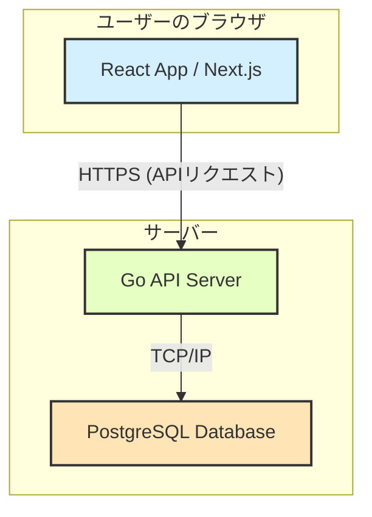
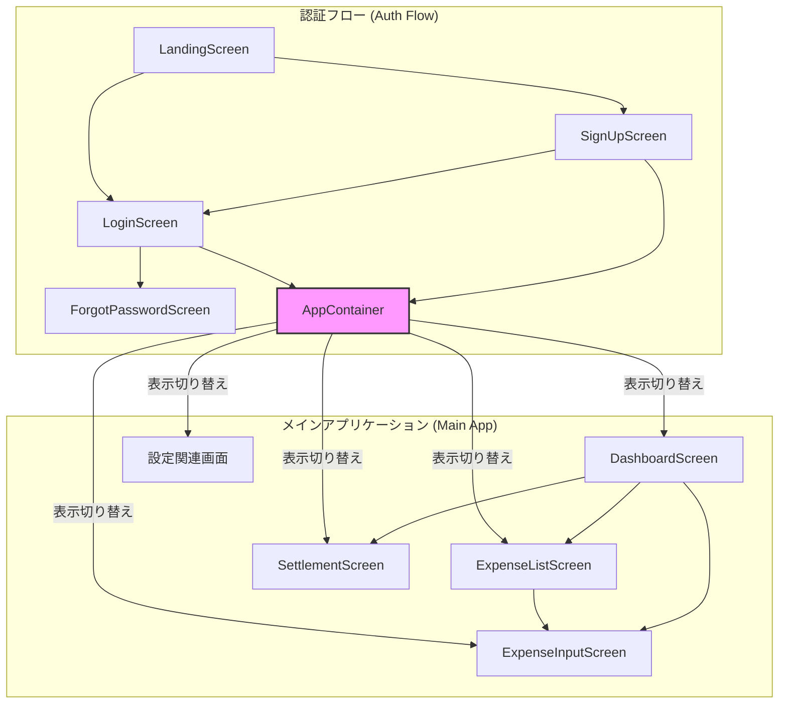

# 【更新版】開発計画書：カップル・夫婦専用家計管理アプリ

## 1. プロジェクト概要

### 1.1. 目的
本プロジェクトは、カップルや夫婦における日々の家計管理の複雑さを解消し、透明性の高い円滑な金銭管理を実現するWebアプリケーションを開発することを目的とします。利用者がお金に関する話し合いをポジティブに進められるような、直感的で使いやすいツールを目指します。

### 1.2. 主要機能
- **認証:** ユーザー登録、ログイン、ログアウト
- **ダッシュボード:** 支出サマリー、予算残高、パートナーとの貸し借りバランスの可視化
- **支出管理:** 支出の登録・編集・削除、一覧表示（フィルタリング、ソート機能付き）
- **カテゴリ管理:** 支出カテゴリの作成・編集・削除
- **分担比率設定:** 全体、またはカテゴリごとに支出の分担比率を柔軟に設定
- **予算管理:** 月次およびカテゴリ別の予算設定と進捗確認
- **精算機能:** 指定期間内の未精算支出を自動計算し、精算処理を実行

## 2. システムアーキテクチャ

本アプリケーションは、フロントエンドとバックエンドを分離した構成を採用します。開発環境はDockerを用いてコンテナ化し、開発者間の環境差異をなくします。

- **フロントエンド:** Next.js (React), TypeScript, Tailwind CSS
- **バックエンド:** Go (標準ライブラリ `net/http`), PostgreSQL
- **インフラストラクチャ:** Docker, Docker Compose

### 2.1. システム構成図

### 2.2. フロントエンド コンポーネント構成案

`devlog/layout-detail.txt` と `devlog/layout-login.txt` のレイアウト案を参考に、認証部分とメインアプリケーション部分をコンポーネントとして整理します。

## 3. 開発フェーズとマイルストーン

開発を以下のフェーズに分けて段階的に進めます。

### フェーズ1: 開発基盤の構築 (Sprint 1)
- **目標:** 開発を開始できる状態を整える。
- **タスク:**
    - [ ] GitHubリポジトリの作成と保護ブランチ（main）設定
    - [ ] `docker-compose.yml` の作成 (Go, PostgreSQL)
    - [ ] DBマイグレーションツールの導入とスキーマ定義 (`db_schema.pu` を基に)
    - [ ] バックエンド: `net/http` を用いたシンプルなWebサーバーの起動
    - [ ] フロントエンド: `create-next-app` によるプロジェクト初期化
    - [ ] フロントエンド: Tailwind CSSのセットアップ

### フェーズ2: 認証機能の実装 (Sprint 2-3)
- **目標:** ユーザーが安全に登録・ログインできる状態にする。
- **タスク:**
    - [ ] **バックエンド:**
        - [ ] ユーザー登録API (`/api/users/signup`) の実装
        - [ ] ログインAPI (`/api/users/login`) の実装 (JWTなどを用いたセッション管理)
        - [ ] 認証が必要なAPIを守るミドルウェアの実装
    - [ ] **フロントエンド:**
        - [ ] ランディングページ (`LandingScreen`) の作成
        - [ ] 新規登録ページ (`SignUpScreen`) の作成とAPI連携
        - [ ] ログインページ (`LoginScreen`) の作成とAPI連携
        - [ ] 認証状態のグローバルな管理 (React Contextなど)

### フェーズ3: 支出管理機能の実装 (Sprint 4-5)
- **目標:** アプリケーションの中核である支出の記録・閲覧機能を使えるようにする。
- **タスク:**
    - [ ] **バックエンド:**
        - [ ] 支出のCRUD API (`/api/expenses`)
        - [ ] カテゴリのCRUD API (`/api/categories`)
    - [ ] **フロントエンド:**
        - [ ] メインレイアウト（サイドバー、ヘッダー）の作成
        - [ ] 支出一覧画面 (`ExpenseListScreen`) の作成（フィルタ、ソート含む）
        - [ ] 支出入力・編集画面 (`ExpenseInputScreen`) の作成
        - [ ] ダッシュボード画面 (`DashboardScreen`) の基本的なレイアウトと支出サマリー表示

### フェーズ4: 高度機能の実装 (Sprint 6-7)
- **目標:** 予算管理と精算機能を追加し、家計管理をより便利にする。
- **タスク:**
    - [ ] **バックエンド:**
        - [ ] 予算設定API (`/api/budgets`)
        - [ ] 精算計算API (`/api/settlements/calculate`)
        - [ ] 精算確定API (`/api/settlements/confirm`)
    - [ ] **フロントエンド:**
        - [ ] 予算管理画面 (`BudgetScreen`) の作成
        - [ ] 精算画面 (`SettlementScreen`) の作成
        - [ ] ダッシュボードに予算と貸し借りバランスの情報を反映

### フェーズ5: 設定機能と仕上げ (Sprint 8)
- **目標:** ユーザーが自身の使い方に合わせてアプリをカスタマイズできるようにする。
- **タスク:**
    - [ ] **バックエンド:**
        - [ ] カップル情報更新API (デフォルト分担比率など)
        - [ ] カテゴリ別分担比率設定API
    - [ ] **フロントエンド:**
        - [ ] カテゴリ管理画面 (`CategoryManagementScreen`) の作成
        - [ ] 分担比率設定画面 (`SplitRatioSettingsScreen`) の作成
        - [ ] 全体的なUI/UXの改善

## 4. 開発ワークフロー
`devlog/ai_project_guidelines.md` に記載されているルールを遵守し、以下の手順で開発を進めます。
1.  **Issue作成:** 機能開発やバグ修正は、まずGitHub Issueを作成することから始めます。
2.  **ブランチ作成:** `main`ブランチからフィーチャーブランチを作成します (例: `feat/15-login-api`)。
3.  **開発:** AIアシスタントと対話しながら、コーディングと単体テストを並行して進めます。
4.  **コミット:** Conventional Commitsの規約に従ってコミットします (例: `feat(api): add login endpoint`)。
5.  **開発ログの記録:** 機能開発のキリが良い単位で、`devlog/daily/YYYY-MM-DD.md` のようなファイルに作業内容を記録します。記録には、実装した機能の概要と関連するIssue番号を含めます。
6.  **プルリクエスト:** `main`ブランチへのマージは必ずプルリクエスト（PR）を作成します。PRには関連するIssueを紐付けます。
7.  **レビュー:** 最低1名のレビューを経てマージします。
